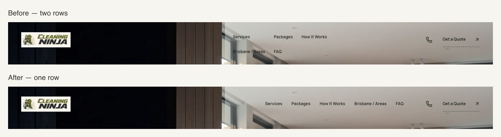
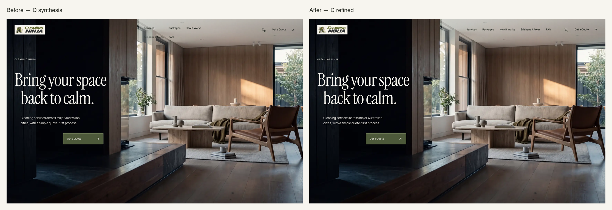
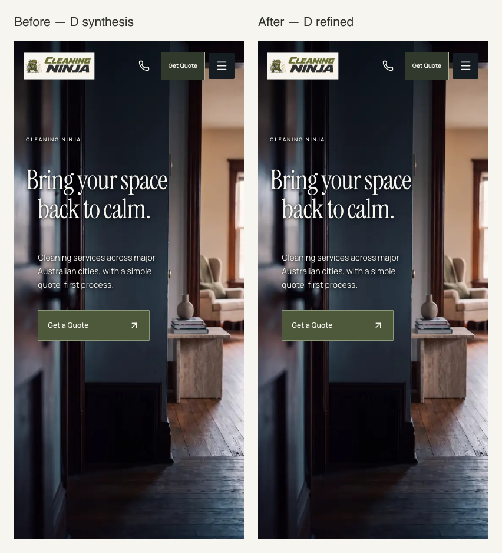

# D HERO MICRO-REFINEMENT REPORT

Subsequent owner decision, 2026-09-28: **desktop D is approved as the static art-direction foundation; mobile is NOT finally approved.** Mobile preservation and passing checks below do not establish cinematic quality or owner approval. H-02/D mobile remains a working baseline requiring dedicated iPhone/mobile art direction and a separate H-02 composition review. See the [checkpoint](../d-hero-checkpoint-report.md); the earlier readiness recommendation below is historical.

28 September 2026 · `rebuild-2026` · D is the lead direction; final static approval remains with the owner.

**Recommendation A — D STATIC COMPOSITION READY FOR OWNER APPROVAL.** The rejected two-row navigation has been corrected. The core composition is preserved, with pixel comparisons confirming that preservation.

## 1. Desktop header correction

All five links now sit on one coherent horizontal line: Services, Packages, How It Works, Brisbane / Areas and FAQ. The navigation cannot wrap, and its labels remain 12px Manrope with 44px-high targets. Gaps range from approximately 26px at 1366 to 36px at 1920.

The group sits entirely in the bright ceiling territory, with communication and quote controls continuing on the same horizontal alignment. A flexible space separates the logo from this cluster, rather than distributing links across the whole image. There is no background bar or new header panel. The overlay height reduces from 126px to 104px; the hero image and composition do not move.

## 2. Header hierarchy

The existing brand mark anchors the left, precisely on the hero's outer alignment. Navigation is the main group on the right; the communication icon is separated from it by a larger group interval. The secondary quote action remains unfilled text with a fine underline and a small arrow.

No olive rectangle is introduced into the desktop overlay. The larger olive hero CTA remains the dominant action. All links, communication behavior and quote destinations are retained. The scrolled warm-ivory header is unchanged.

## 3. Logo treatment

The existing 94% display scale is retained: further reduction would trade recognition and raster lettering clarity for only a small reduction in visual weight. The link retains a 48px layout height, yielding a visible target greater than 44px after scaling. The logo aligns at 2.7vw, matching the desktop headline's outer edge, with clear space above and a large uninterrupted interval to the navigation.

Its vertical positioning now follows the common header alignment rather than an independent top margin. No source image, wordmark, mascot, backing, crop or colour was changed; no background removal was attempted.

**Remaining interruption: noticeable, but contained.** The ivory rectangle still reads as a badge against the dark threshold and is the most conspicuous brand-surface mismatch. The calmer single-row header reduces competing structure but cannot disguise that backing. Retain the separate future Brand Lockup Sprint recommendation; do not keep shrinking the current artwork to compensate for it.

## 4. Hero optical adjustments

**None required.** Eyebrow, headline position and scale, two-line wording, second-line inset, support position and all group intervals remain unchanged.

“Bring your space / back to calm.” remains upright Instrument Serif at 86.4px for 1440×900 and 46.02px for 390×844. Authored asymmetry and the dark-threshold / warm-room balance are intact. Pixel comparisons at all four desktop sizes show the entire image below y126 is identical to the synthesis baseline.

## 5. CTA adjustments

**None required.** The hero keeps its olive rectangle, fine border, 1px corners, arrow spacing and architectural alignment. Dimensions remain 196×54px desktop, 190×52px on the main mobile references, and 184×52px at 320.

The corrected header makes the action hierarchy clearer without changing the approved CTA family or adding motion.

## 6. Mobile observations

**Mobile remains unchanged.** Its 84px overlay already provides usable space around the existing logo, communication control, compact quote and menu. All visible targets remain at least 44px high with no overlap at 320, 375, 390 or 430px.

Further spacing changes would consume scarce width at 320 without a clear optical benefit. The headline, support, CTA and doorway relationship are preserved. All four full-viewport mobile screenshots are pixel-identical to the previous D captures; the before/after sheet intentionally shows that preservation.

## 7. Responsive validation

| Viewport | Result |
| --- | --- |
| 1440×900 | One-row desktop navigation; two-line title; all controls in view |
| 1366×768 | No cramped wrapping or overlap at the narrowest requested desktop |
| 1728×1000 | Disciplined spacing with the group contained in the ceiling area |
| 1920×1080 | Navigation gaps cap at 36px; room remains open |
| 390×844 | Primary mobile composition unchanged |
| 320×568 | Header targets remain usable; headline stays two lines; CTA visible |
| 375×812 | Mobile composition unchanged; no overflow |
| 430×932 | Mobile composition unchanged; no overflow |

The checks use actual text rectangles to verify one line per navigation label and matching y positions for all links. Header controls have no overlap, remain within the viewport and retain at least 44px height. Every hero CTA remains fully visible. Verification is Chromium-based, not a physical-device or Safari claim.

## 8. Before/after screenshots

- [Refined D desktop — 1440×900](screenshots/after-desktop.png)
- [Refined D mobile — 390×844](screenshots/after-mobile.png)
- [Desktop before/after](screenshots/desktop-before-after.png)
- [Mobile before/after — unchanged by design](screenshots/mobile-before-after.png)
- [Header close review](screenshots/header-before-after.png)

Only D comparisons were produced. Baselines and comparison evidence are preserved in ignored `.local-evidence/d-micro-refinement/`; existing A/B/C deliverables were not revisited or regenerated.

## 9. Technical checks

- `npm run typecheck`: passed.
- `npm run lint`: passed; 0 errors and 70 existing warnings.
- `npm run test:unit`: 20 passed, using synthetic/local services.
- `npm run build`: passed, including existing content/prebuild checks. Existing release restrictions and content warnings remain; this is not deployment approval.
- D-only Playwright checks: all 9 cases passed across the run and desktop rerun—eight requested viewport compositions plus reduced-motion focus, menu/communication dialogs, scrolled header, sticky-quote lifecycle and quote navigation.
- The first desktop run exposed an incorrect test assumption relating line height to target height. It was replaced with a direct count of rendered text-line rectangles; all four desktop cases passed. No design defect was concealed or layout altered to satisfy the test.
- No console/page errors in final D captures; no video, Cut preview or H-03/MP4 request. No lead or message submissions.
- Pixel preservation: 4/4 desktop regions below the previous header extent are identical; 4/4 complete mobile viewports are identical.
- Mechanical design scan of the changed CSS: no findings. `git diff --check`: passed.
- Production isolation: all 4 route/viewport cases passed (default and D at 1440×900 and 390×844). D screenshots were byte-identical to the production default, with no lab component, design attribute, video or browser error.

Runtime changes in this pass are confined to D's desktop overlay CSS; the development allowlist and component rendering logic are unchanged. No dependencies, source media, lower sections or H-03 files were changed.

Review locally at `http://127.0.0.1:8136/?hero-design=d`. D remains opt-in and development-only.

## 10. Recommendation

**A. D STATIC COMPOSITION READY FOR OWNER APPROVAL.**

The specific rejected behavior is resolved. One-row navigation, quieter header actions, intact language and pixel-preserved hero/mobile composition make this a completed micro-refinement rather than another concept round. The raster logo backing remains a known constraint for a separate future brand task, not a reason for another spacing pass.

This recommendation does not claim owner approval or activate D. No commit, default activation, H-01/H-02 change, H-03 work, Higgsfield, lower-page work, deployment or merge. Stop here.
