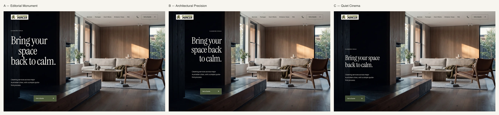
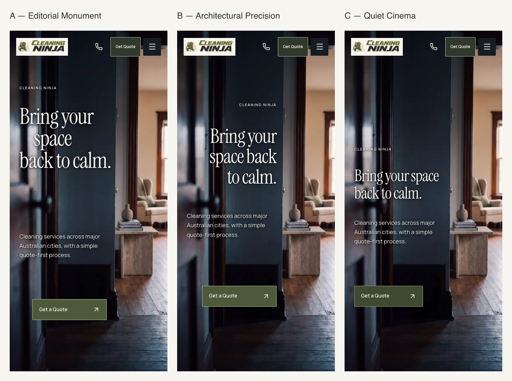

# HERO ART DIRECTION REPORT

Current owner gate, 2026-09-28: desktop D is now the approved static art-direction foundation. Mobile H-02/D is **not finally approved**; it remains a working baseline pending dedicated iPhone/mobile art direction and H-02 composition review. This report records the earlier exploratory stage; its recommendations are not the current approval state. See the [checkpoint](../d-hero-checkpoint-report.md).

28 September 2026 · `rebuild-2026` · DEVELOPMENT ONLY · Awaiting owner visual review.

Exactly three compositions are implemented. **Recommend Direction B for owner review.** It has the clearest relationship to the architectural threshold and THE NINJA CUT, while leaving the room open. This is a recommendation, not a selection or approval.

## 1. Direction A — Editorial Monument

**Visual idea:** a staggered three-line title: “Bring your / space / back to calm.” The indentation makes “space” a pause inside the sentence. The title begins at 24% of the desktop hero; the support copy sits on a separate lower register and the action shifts towards the threshold.

- **Strongest quality:** the most memorable typographic silhouette and strongest campaign presence.
- **Weakest quality:** the solitary “space” and displaced CTA can feel self-conscious. The generous interval before service copy makes the business proposition slower to scan.
- **H-01/H-02 relationship:** large lettering occupies the dark plane without crossing into the room. Mobile uses a smaller indentation, a 22% title start and a different lower action position; the portrait doorway stays visible.
- **Distinctiveness:** highest expressive contrast with a conventional cleaning hero; upright serif and asymmetry avoid relying on luxury italics.
- **Scalability:** useful for major campaign moments and occasional opening statements. Repeating staggered text throughout the site would dilute the effect and harm scanning. No lower sections were changed.

## 2. Direction B — Architectural Precision

**Visual idea:** the eyebrow, right-aligned title and action share an invisible vertical edge just inside the dark threshold. The support paragraph is left-aligned for reading, with its right boundary on that same edge. Line breaks are “Bring your / space back / to calm.”

- **Strongest quality:** the type seems located by the architecture rather than laid over a photograph. It is controlled without becoming anonymous.
- **Weakest quality:** a right-aligned headline is less immediately conversational. The “space back” break is visually useful but less natural than the original two-line sentence.
- **H-01/H-02 relationship:** desktop alignment follows the centred H-01 cover plane, including the taller 1440×900 crop. Mobile derives its own edge from H-02's dark wall, with the headline at 28% and support at 53% of the portrait.
- **Distinctiveness:** strongest connection to Cleaning Ninja's precision and THE NINJA CUT. No visible grid, animated cut or video is involved.
- **Scalability:** the most useful foundation for future page alignment, bounded image/text relationships and disciplined controls. This does not authorise applying it elsewhere.

## 3. Direction C — Quiet Cinema

**Visual idea:** a compact two-line film-title composition lower in the dark plane, with a large uninterrupted interval above. “Bring your space / back to calm.” The narrower olive action reads as a small, deliberate object.

- **Strongest quality:** image breathing room and calm. The room's light and depth lead the experience.
- **Weakest quality:** the least distinctive as a cleaning brand. It comes closest to an architectural-interiors website, and the first impression depends heavily on the photograph.
- **H-01/H-02 relationship:** H-01 carries most of the emotional work; H-02 uses a 40% headline start and independently spaced support/action. The mobile title remains two lines.
- **Distinctiveness:** quiet authority, but weaker brand recognition than A or B.
- **Scalability:** appropriate for image-led stories and secondary editorial surfaces; less convincing as the defining flagship system without stronger brand cues.

## 4. Desktop comparison

Primary capture: **1440×900**. All three keep the room, dark threshold and depth cues legible. A gives typography the most authority; B gives alignment the most authority; C gives the photograph the most authority. Variants occupy the complete first viewport, including the slightly taller 1728×1000 case, without an arbitrary page max-width.

## 5. Mobile comparison

Primary capture: **390×844**. These are independent H-02 compositions, not scaled desktop groups. A is the most expressive; B's title stays on the more consistent dark wall; C is the quietest. All have a visible primary CTA and keep the right-hand doorway open. The sticky quote stays hidden until the hero CTA passes the header.

## 6. Typography decisions

Instrument Serif remains upright, weight 400, with no decorative italic. Manrope handles the eyebrow, support and controls. Text and meaning are unchanged; only line breaks differ. Title tracking is −0.028em. Body copy is 15px desktop / 14px mobile, line-height 1.65, using deliberately short measures on the narrow dark plane.

| Decision | A | B | C |
| --- | --- | --- | --- |
| Headline at 1440×900 | 96.48px / .96 | 79.92px / 1 | 59.04px / 1.06 |
| Headline at 390×844 | 54.6px / 1 | 49.14px / 1.02 | 40.17px / 1.08 |
| Headline at 320×568 | 44px | 42px | 35px |
| Desktop support width | 280px | 265px | 270px |
| Mobile support width at 390 | 218px | 221.7px | 218px |
| Title structure | Staggered 3 lines | Right-aligned 3 lines | Compact 2 lines |

The eyebrow is restrained Manrope 600: 10px desktop / 9px mobile, with .16–.20em tracking. It identifies the brand rather than carrying an invented promise. Fonts and delivery configuration are unchanged.

## 7. Header observations

The same header treatment is used across A/B/C to keep the comparison controlled. Desktop overlay height increases from 88px to 104px, the existing logo backing is slightly tightened, navigation spacing is more deliberate, and the header quote becomes an outlined secondary action. Mobile uses an 80px overlay with a darker olive secondary quote control; controls retain their touch targets.

The source logo assets and all navigation/communication functions are unchanged. The warm-ivory scrolled state remains. The result is less dominant, but still recognisably a navigation bar: the retained five links and communication control impose that structure. Its compact raster logo remains a visual constraint, not something this sprint redesigns.

## 8. CTA observations

Olive remains the primary action colour. Buttons are rectangular, with 0–1px corners, a fine muted-olive border, Manrope 600 labels and a small up-right arrow. Desktop sizes: A 202×54px; B 190×54px; C 176×52px. Mobile: A/B 184×52px; C 170×52px. Hover translates only the arrow by 2px; reduced motion suppresses the transition. Focus remains conspicuous.

A's action is deliberately offset from its paragraph. B's action terminates on the architectural alignment. C's darker, narrower control is the most object-like. Existing header functionality and its compact mobile label are preserved; every hero action reads “Get a Quote.”

## 9. Responsive findings

**24/24 compositions passed:** each of A/B/C at 1440×900, 1366×768, 1728×1000, 1920×1080, 390×844, 320×568, 375×812 and 430×932.

- Header, eyebrow, headline, supporting copy and CTA remain fully in the first viewport.
- No horizontal overflow, headline/body overlap or body/CTA overlap at the requested sizes.
- The 320px layout has dedicated spacing and type sizes; it does not inherit the tall-phone spacing blindly.
- H-01 is selected on desktop and H-02 on mobile. No extra transforms, source-image modifications or motion are introduced.
- The existing mobile text shadow provides local contrast support over H-02's foreground reflections. No black text panels, glass, broad new gradients or new colours were added. Contrast was visually reviewed; this is not a formal per-pixel photographic contrast certification.
- Intermediate tablet styles are provided, but the stated verification matrix is the owner's eight requested sizes. Physical-device/Safari verification is outside this Chromium pass.

## 10. Screenshots / contact sheets

| Direction | Desktop 1440×900 | Mobile 390×844 |
| --- | --- | --- |
| A | [Full capture](screenshots/a-1440x900.png) | [Full capture](screenshots/a-390x844.png) |
| B | [Full capture](screenshots/b-1440x900.png) | [Full capture](screenshots/b-390x844.png) |
| C | [Full capture](screenshots/c-1440x900.png) | [Full capture](screenshots/c-390x844.png) |

[Desktop comparison](screenshots/desktop-comparison.png) · [Mobile comparison](screenshots/mobile-comparison.png).

All 24 viewport captures and local run logs are retained in ignored `.local-evidence/hero-art-direction/`. The six primary captures and two sheets above are review deliverables. Contact sheets assemble screenshots only; approved source imagery was not edited.

## 11. Technical checks

- `npm run typecheck`: passed.
- `npm run lint`: passed, 0 errors / 70 existing warnings.
- `npm run test:unit`: 20 passed; synthetic/local services only.
- `playwright test --config=playwright.hero-design.config.ts`: 28 passed. Covers the full matrix, reduced-motion focus, mobile dialogs, warm-ivory scroll state, sticky-quote lifecycle, quote navigation, invalid/default queries and unchanged lower-section markup. No lead submissions.
- Every capture test combines `hero-design` with `hero-motion=masked&ninja-cut=1`, performs a trusted click, and verifies no H-03/MP4 request, video or Cut preview. The laboratory uses a separate static picture and never enters the H-03 lifecycle.
- Standalone Chromium reports no console/page errors in the final matrix. The browser-tool baseline emitted a hydration warning from its injected transparent-caret styles; clean standalone contexts did not reproduce it.
- `npm run build`: passed, including the existing content/prebuild checks. Existing content warnings and release blockers remain unchanged; this is not release approval.
- Production browser gate: 8/8 routes passed (default and A/B/C at 1440×900 and 390×844). Each parameterised screenshot was byte-identical to its production default screenshot, with no lab attribute, lab component, video or browser error.
- The design detector's single warning is a false positive for the image whose `src` is supplied by `getImageProps`; browser decoding and image selection passed.
- `git diff --check`: passed. No dependency, source-media, H-03 implementation or lower-section design changes.

Development entry is guarded by `NODE_ENV === 'development'`; unknown values fall back to the incumbent hero. The initial server render remains the incumbent hero, followed by the opt-in client study after hydration. Switching studies remounts the existing sticky-quote observer so it tracks the new CTA. The production gate passed as recorded above.

For local review, run `node_modules/.bin/next dev -p 8136 -H 127.0.0.1`, then open `/?hero-design=a`, `/?hero-design=b`, or `/?hero-design=c`. The dedicated Playwright configuration starts its own isolated server and refuses to reuse an occupied port.

Implementation references: [HeroDesignLab.tsx](../../../components/homepage/HeroDesignLab.tsx), [scoped CSS](../../../components/homepage/hero-design-lab.css), [development selector](../../../components/homepage/Homepage.tsx), [focused checks](../../../tests/hero-design.spec.ts).

## 12. Recommended direction for OWNER REVIEW

**Review B first, A second, C third.** B best reconciles the flagship ambition with the room's architecture and Cleaning Ninja's precision. A is the challenger if the owner prioritises an overt editorial statement. C is a useful restraint benchmark but is too dependent on the interior image to be the strongest brand signature.

No direction has been activated by default or selected on the owner's behalf. No commit, push, deployment, merge, media generation or Higgsfield call. H-01/H-02 remain the approved default stills; the preserved H-03 experiment is unchanged. Stop here for owner visual review.
