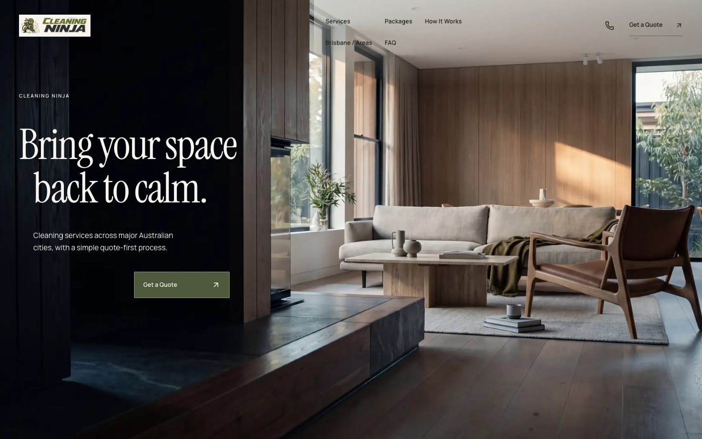
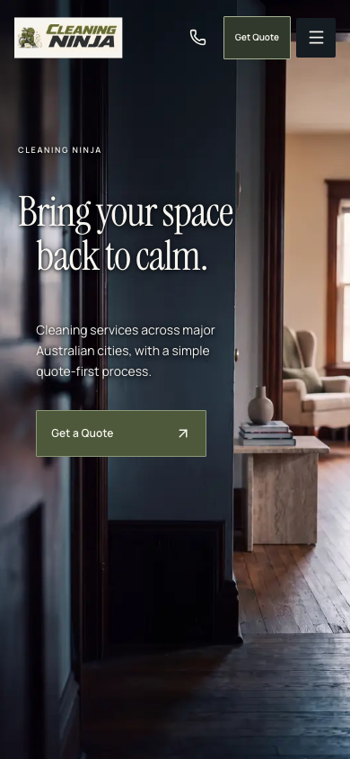
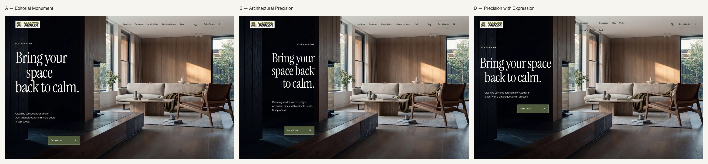
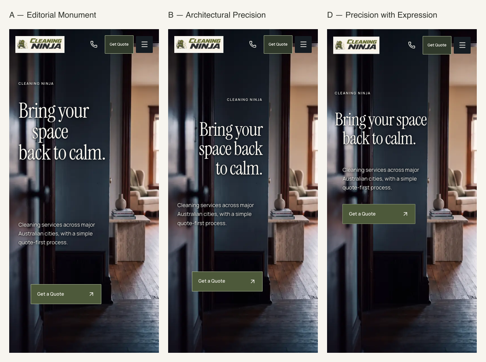

# HERO SYNTHESIS REPORT

Current owner gate, 2026-09-28: desktop D, with its subsequent one-row header refinement, is the approved static art-direction foundation. Mobile H-02/D is **not finally approved**; the owner reports insufficient visual/cinematic strength at an iPhone 16-class viewport. Retain it only as a working baseline for a dedicated mobile sprint. The recommendations below are historical; see the [checkpoint](../d-hero-checkpoint-report.md).

28 September 2026 · `rebuild-2026` · Development-only · No final hero approval.

**Recommendation: APPROVE D FOR FURTHER REFINEMENT.** This is the requested design recommendation, not owner approval, production activation or permission to begin another sprint.

## 1. D creative rationale

**Precision with Expression** retains B's relationship to the architectural threshold, gives the headline more authority, and reduces the number of title lines so the photograph can breathe. It is a synthesis of the three studies rather than another visual identity.

The movement is spatial, not animated: the sentence begins near the left edge, its second line moves slightly inward, and the desktop CTA terminates at the architectural boundary. Precision supplies the alignment; controlled asymmetry gives expression; the uninterrupted room and lower foreground supply calm. No decorative rule, frame, visible grid or new accent colour is needed.

## 2. Headline decision

**Bring your space / back to calm.** Exactly two lines at all eight requested sizes. Upright Instrument Serif, weight 400. No isolated “space”, unnatural “space back” phrase, italic or rewritten wording.

At 1440×900, D is **86.4px**, between B's 79.92px and A's 96.48px. Line-height is 1.03 and tracking −0.03em. The second line is inset by .34em; this is a small optical step, not A's standalone-word gesture. At 390×844, the independent mobile size is **46.02px**, line-height 1.06, tracking −0.028em, with a .44em second-line step. Two lines occupy less height than either A or B while retaining a confident first line.

## 3. Desktop composition

H-01 is unchanged. At 1440×900, the headline starts around **x39/y252**, with its first line ending around x485, just inside the dark architectural plane. The second line and supporting paragraph begin around x68. The CTA ends at approximately x471, preserving B's inset from the threshold.

The headline starts at 28% of viewport height. The 40px interval after the title is deliberate; information and action then advance through the composition without leaving A's large disconnected gap. The bright room, stone return and foreground remain open. At wider sizes, the headline scales to 115px at 1920 while the support measure remains controlled.

## 4. Mobile composition

H-02 is unchanged. Mobile opens from the left rather than repeating B's formal right alignment. At 390×844, the headline starts at **x20/y211**; its second line, supporting paragraph and CTA share an inner alignment around x40. The doorway remains exposed to the right, with substantial floor and architectural depth below the action.

The support begins approximately 46px below the two-line title, followed by a 32px gap before the CTA. At 320×568, the title becomes 36px, the support returns to the outer 20px alignment, and its measure narrows to 184px to clear the bright doorway. That exception is a composed small-screen layout, not a scaled desktop block.

## 5. Support-copy treatment

Exact approved wording is retained: “Cleaning services across major Australian cities, with a simple quote-first process.”

Manrope is **15px / 1.7** on desktop and **14px / 1.65** on mobile. Desktop measure is 300px; mobile measure follows the wall, approximately 213px at 390. The text aligns with the second headline line rather than becoming a generic paragraph under the first line. It and the CTA use normal vertical flow within one positioned group, so line wrapping moves the action safely rather than causing overlap.

## 6. CTA integration

The label remains **Get a Quote**. Olive rectangle, 1px muted-olive border, 1px corner radius, restrained Manrope 600 label and a separated up-right arrow. Dimensions: **196×54px desktop**, **190×52px mobile**, **184×52px at 320**.

Desktop action aligns to B's architectural boundary and steps right from the reading column. Mobile action aligns to the inset reading column, preventing the detached or overly formal effect of earlier studies. The 36px desktop / 32px mobile interval connects the action to the copy while keeping it visually distinct. No new animation or motion treatment was introduced.

## 7. Header integration

The desktop overlay now has three distinct placements: the existing logo at the headline's left alignment; a compact, two-row navigation index beginning inside the bright ceiling area; and communication/quote actions at the right. It no longer reads as one evenly distributed horizontal strip.

All five navigation links remain, in their original reading order. Their text is 12px and interactive heights remain at least 44px. The quote action becomes a quiet underline rather than a second outlined button competing with the hero CTA. Logo display scale is reduced by 6%, with a minimum target height preserved. Mobile keeps the existing usable control arrangement, with an 84px overlay and the same modest logo scale adjustment.

These treatments apply only to D's unscrolled overlay. The warm-ivory scrolled header and existing navigation, menu and communication behavior remain. The two-row arrangement is a purposeful departure from the previous header, but still deserves owner judgement as a stylistic choice.

## 8. Logo-lockup constraint

**The ivory rectangular backing remains the largest unresolved brand/composition mismatch.** Against the dark threshold, its hard, high-contrast rectangle reads like a pasted badge. It attracts attention before the subtler navigation and interrupts the otherwise integrated photographic surface. On mobile, the effect is more pronounced because the badge occupies a greater share of the header. Reducing scale helps its dominance but cannot remove the underlying mismatch.

The mascot and existing lettering retain recognition; the problem is the opaque backing and the constraints of the raster lockup, not a reason to erase the existing identity. No logo pixel, wordmark, mascot, source asset, crop or colour was changed in this pass.

**Recommend a separate, owner-authorised BRAND LOCKUP SPRINT:** obtain original master artwork if available; evaluate an authentic transparent/vector lockup and approved light/dark applications preserving the existing identity; establish clear space, minimum sizes and header-specific proportions. Assess each against both the dark photographic overlay and warm-ivory scrolled state. Do not simply remove the backing and assume the dark/olive artwork will remain legible. This recommendation is documented only; no brand asset work has begun.

## 9. A vs B vs D comparison

| Study | What it contributes | Remaining tradeoff |
| --- | --- | --- |
| A | The strongest campaign-like typographic gesture | Isolated “space” and detached lower action feel self-conscious |
| B | The clearest threshold grid and geometric control | Awkward phrase grouping and formal mobile alignment |
| D | Natural two-line language, assertive scale, stepped alignment and open room | Ivory logo backing still interrupts the integrated header; new navigation arrangement needs owner review |

D is more readable than B, more disciplined than A, and less dependent on the photograph than C. It does not carry A's maximum theatricality; that is an intentional trade for natural language and a composition that can become a broader system.

The sheets use fresh A/B captures alongside D. A/B/C styles and default activation behavior remain unchanged.

## 10. Responsive findings

| Viewport | D headline | Composition |
| --- | --- | --- |
| 1440×900 | 86.4px | Primary desktop; natural two-line title, threshold-aligned action |
| 1366×768 | 81.96px | Compact desktop; header and action remain clear |
| 1728×1000 | 103.68px | Maintains architecture and support measure |
| 1920×1080 | 115px | Capped display size; room remains dominant on the right |
| 390×844 | 46.02px | Primary portrait; inner text/action alignment |
| 320×568 | 36px | Dedicated 184px body measure and shorter vertical intervals |
| 375×812 | 44.25px | Natural two-line title with doorway clearance |
| 430×932 | 50.74px | More negative space without losing authority |

At every requested size, the title remains two lines, support remains readable, the CTA is in the first viewport, and no text groups or header controls overlap. No horizontal overflow. H-01/H-02 selection is correct. Existing photographic contrast support is retained; no broad new gradient or panel is used. Verification is in Chromium, not a claim of physical-device or Safari coverage.

## 11. Technical checks

- `npm run typecheck`: passed.
- `npm run lint`: passed, 0 errors and 70 existing warnings.
- `npm run test:unit`: 20 passed, using synthetic/local services.
- `npm run build`: passed, including existing content/prebuild checks. Existing content warnings and release restrictions remain; this is not deployment approval.
- **37 focused browser cases covered:** the 28 existing A/B/C/default cases passed, and all 9 D cases passed on the focused rerun. D covers the eight required viewports plus reduced-motion focus, dialogs, scroll state, sticky-quote lifecycle and quote navigation. Exact two-line wording, control bounds, target heights and non-overlap are checked.
- The initial D run exposed an assertion precision issue: Chromium's intersection ratio for the transformed logo was 0.99999994 rather than 1. The corrected assertion allows that rounding while separately requiring every control's exact rectangle to lie inside the viewport. All D cases then passed; no visual defect was hidden by weakening bounds checks.
- No console/page errors in final D capture tests. Static-only checks verify no video, Cut preview or H-03/MP4 request even when conflicting experiment parameters are supplied.
- **Production isolation: 10/10 route/viewport cases passed.** Default and A/B/C/D at 1440×900 and 390×844 had no lab component, design attribute, video or browser error. Each parameterised screenshot was byte-identical to the production default at that viewport.
- `git diff --check`: passed.

Local logs and all D viewport captures are in ignored `.local-evidence/hero-synthesis/` and `.local-evidence/hero-art-direction/`; review deliverables are in this report's `screenshots/` directory. [D desktop](screenshots/d-1440x900.png), [D mobile](screenshots/d-390x844.png), [A/B/D desktop sheet](screenshots/desktop-comparison.png), [A/B/D mobile sheet](screenshots/mobile-comparison.png).

The only runtime changes in this pass are adding `d` to the existing development-only allowlist, grouping D's support/action for responsive flow, and adding D-scoped hero/header CSS. No dependency or source-media changes. The default hero, H-03 implementation, lower-page layout and content remain unchanged. No leads or messages were submitted during testing.

The design detector's single image warning is the known static-analysis false positive for `getImageProps` spreading the image source; actual image decode and selection are checked in Chromium.

Local review: `http://127.0.0.1:8136/?hero-design=d`. A/B/C remain available for comparison. Server hydration starts from the default hero and then shows the opt-in development study, as in the prior laboratory; production never selects D.

## 12. Recommendation

**APPROVE D FOR FURTHER REFINEMENT.** It resolves B's language problem and A's isolated-word gesture, preserves a strong architectural relationship, and gives the image more breathing room. There is no reason to return to A or B as the lead direction based on this pass.

This is not final hero approval. The owner should judge D's overall composition and the two-row desktop navigation; the ivory raster backing should become a separate brand-lockup brief. No further refinement or brand work is performed here.

No commit, default activation, source-media edit, H-03 work, Higgsfield call, lower-page redesign, deployment or merge. **Stop at this report.**
